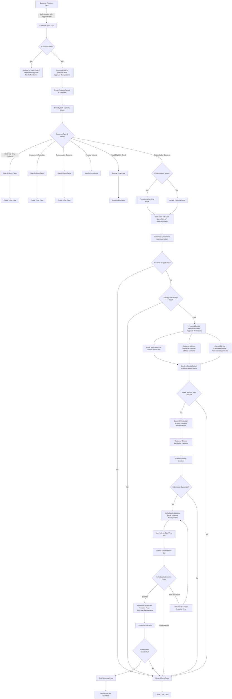

# Customer Journey

This flow diagram shows the complete Cable to Fiber upgrade process from initial SMS to installation scheduling.

## Traverse the flow

```mermaid
%%{
  init: {
    'theme': 'default',
    'flowchart': {
      'useMaxWidth': false,
      'htmlLabels': true,
      'curve': 'basis',
      'nodeSpacing': 100,
      'rankSpacing': 120
    },
    'themeVariables': {
      'nodeBorder': '#9370DB',
      'mainBkg': '#ECECFF',
      'nodeTextSize': '20px',
      'edgeLabelBackground': '#e8e8e8',
      'fontSize': '18px',
      'primaryBorderWidth': '2px',
      'primaryColor': '#1f77b4',
      'primaryTextColor': '#333333',
      'lineColor': '#333333',
      'arrowheadColor': '#333333'
    }
  }
}%%
graph TD
    %% Initial SMS and Landing Flow
    Start[Customer Receives SMS] -->|SMS contains URL: /upgrade-fiber| Click[Customer clicks URL]
    Click --> SessionCheck{Is Session Valid?}
    SessionCheck -->|No| LoginRedirect[Redirect to Login: /login?PageName=upgrade-fiber%2Fwelcome]
    SessionCheck -->|Yes| ProcessEntry[Process Entry in Personal Zone: /upgrade-fiber/welcome]
    
    %% Entry to Process
    ProcessEntry --> DBRecord[Create Process Record in Database]
    DBRecord --> EligibilityCheck[Core System Eligibility Check]
    
    %% Customer Type and Eligibility Checks
    EligibilityCheck --> CustomerTypeCheck{Customer Type & Status?}
    
    %% Non-Eligible Paths with Error Pages
    CustomerTypeCheck -->|Electricity-Only Customer| ErrorPage1[Specific Error Page]
    CustomerTypeCheck -->|Customer in Retention| ErrorPage2[Specific Error Page]
    CustomerTypeCheck -->|Disconnected Customer| ErrorPage3[Specific Error Page]
    CustomerTypeCheck -->|Pending request| PendingRequestPage[Specific Error Page]
    CustomerTypeCheck -->|Failed Eligibility Check| GeneralError[General Error Page]
    
    %% Eligible Path - URL Check for eligible customers
    CustomerTypeCheck -->|Eligible Cable Customer| URLCheck{URL in content system?}
    URLCheck -->|Yes| PromoPage[Promotional Landing Page]
    URLCheck -->|No| PersonalZone[Default Personal Zone]
    
    %% Continue to Static Welcome View
    PromoPage --> StaticWelcomeView["Static View with User Name from API #welcome-page"]
    PersonalZone --> StaticWelcomeView
    StaticWelcomeView --> ContinueButton["Submit Go Ahead Form #continue-button"]
    
    %% Upgrade Key Verification
    ContinueButton --> UpgradeKeyCheck{"Received Upgrade Key?"}
    UpgradeKeyCheck -->|No| GeneralErrorPage["General Error Page"]
    UpgradeKeyCheck -->|Yes| GetUpgradeDataApiCheck{"GetUpgradeDataApi Valid?"}
    GetUpgradeDataApiCheck -->|No| GeneralErrorPage["General Error Page"]
    GetUpgradeDataApiCheck -->|Yes| DetailsValidation["Personal Details Validation Screen: /upgrade-fiber/details"]
    DetailsValidation --> EmailVerification["Email Verification/Edit Option #email-field"]
    DetailsValidation --> AddressDisplay["Customer Address Display #customer-address-container"]
    DetailsValidation --> ServiceCategories["Current Service Categories Display #service-categories-list"]
    
    %% Details Confirmation
    EmailVerification --> DetailsConfirmation["Confirm Details Button #confirm-details-button"]
    AddressDisplay --> DetailsConfirmation
    ServiceCategories --> DetailsConfirmation
    
    %% Server Validation after Confirm Details
    DetailsConfirmation --> ServerValidation{"Server Returns Valid Status?"}
    ServerValidation -->|Yes| BandwidthSelection["Bandwidth Selection Screen: /upgrade-fiber/bandwidth"]
    ServerValidation -->|No| GeneralErrorPage["General Error Page"]
    
    %% Bandwidth Selection
    BandwidthSelection --> PackageChoice["Customer Selects Bandwidth Package"]
    PackageChoice --> PackageSubmit["Submit Package Selection"]
    PackageSubmit --> PackageSubmitCheck{"Submission Successful?"}
    PackageSubmitCheck -->|Yes| SchedulePage["Schedule Installation Page: /upgrade-fiber/schedule"]
    PackageSubmitCheck -->|No| GeneralErrorPage["General Error Page"]
    GeneralErrorPage --> CRMErrorCase["Create CRM Case"]
    
    %% Schedule Installation Process
    SchedulePage --> SlotSelection["User Selects Date/Time Slot"]
    SlotSelection --> SubmitSchedule["Submit Selected Time Slot"]
    SubmitSchedule --> ScheduleCheck{"Schedule Submission Check"}
    ScheduleCheck -->|Success| SuccessPage["Installation Scheduled Success Page: /upgrade-fiber/success"]
    SuccessPage --> ConfirmationButton["Confirmation Button"]
    ConfirmationButton --> ConfirmationCheck{"Confirmation Successful?"}
    ConfirmationCheck -->|Yes| DealSummary["Deal Summary Page"]
    ConfirmationCheck -->|No| GeneralErrorPage
    DealSummary --> SendEmail["Send Email with Summary"]
    ScheduleCheck -->|General Error| GeneralErrorPage["General Error Page"]
    ScheduleCheck -->|Time Slot Taken| SlotTakenError["Time Slot No Longer Available Error"]
    SlotTakenError --> SchedulePage
    
    %% CRM Case Creation for Non-Eligible
    ErrorPage1 --> CRMCase1[Create CRM Case]
    ErrorPage2 --> CRMCase2[Create CRM Case]
    ErrorPage3 --> CRMCase3[Create CRM Case]
    GeneralError --> CRMCaseGeneral[Create CRM Case] 
```