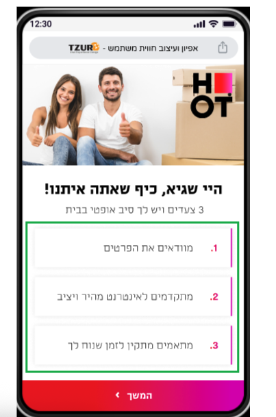
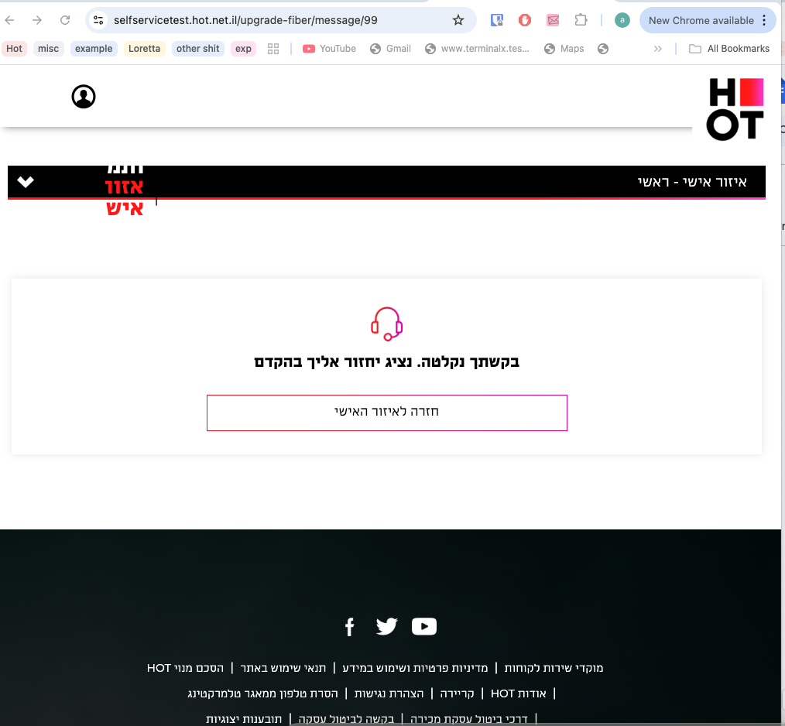

# Bug Report: Fiber User Receives Incorrect Success Code 99

## Bug ID
BUG_DD_CR12575_02

## Status
OPEN

## Environment
- **Browser**: WebKit (iPhone 13)
- **Device**: Mobile
- **User Type**: Fiber user (asaf golan)

## Steps to Reproduce
1. Login to personal zone as existing fiber user (asaf golan)
2. Navigate to `/upgrade-fiber`

## Expected Result
User should be redirected to the welcome view with upgrade options.

## Actual Result
User sees success code 99 message which is incorrect for fiber users.

## Technical Details
- Fiber users should not receive code 99 (success), as they're already fiber customers
- Existing fiber customers should be able to coordinate with the upgrade flow
- Expected behavior is to show the welcome screen with appropriate options

## Assigned To
Fiber Integration Team

## Related Design Ticket
DT_5.2.2

