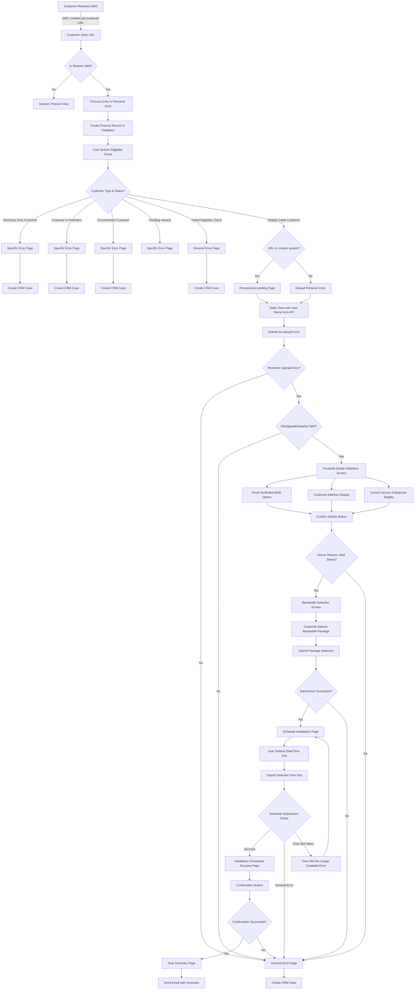

# Cable to Fiber Upgrade Flow: Step by Step

## One-Click Fiber Upgrade Process

### Process Details:

1. **SMS Campaign**:
   - Marketing sends SMS to Fiber-Ready customers with personalized link
   - SMS content includes promotional message about fiber availability
   - Customer is prompted to click link to begin upgrade process

2. **Eligibility Verification**:
   - Upon entry, system creates process record in database
   - Core systems verify eligibility for one-click upgrade
   - System checks customer type and current status

3. **Non-Eligible Scenarios**:
   - Electricity-only customers → Specific error page + CRM case
   - Customers in retention programs → Specific error page + CRM case
   - Disconnected customers (up to 6 months) → Specific error page + CRM case
   - Customers failing general eligibility → General error page + CRM case

4. **Eligible Customers**:
   - Based on existing one-click upgrade process
   - Customer selects from available fiber packages
   - Only bandwidth change required (no additional payment)
   - Upgrade completed with confirmation
   - System checks session validity
   - If session expired, shows timeout page
   - If valid, proceeds to main promotional content

This is the first step in the customer journey for the Cable to Fiber upgrade process.
